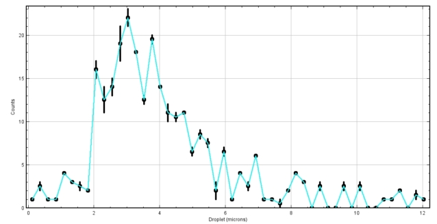
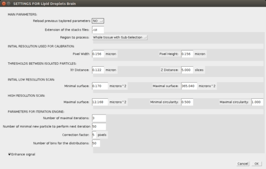
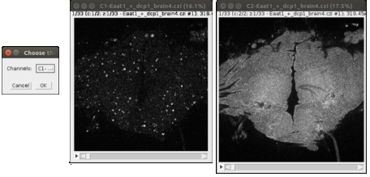

**Automated Detection of Lipid Droplets in *Drosophila M.* brain**
===

||||
|-------------------------------------|-----------------------------------|-----------------------------------|-----------------------------------|
|**ORIGINAL**   |**TREATED**   |**DISTRIBUTION**   |**STATISTICS ENABLED**   |

**Contributors**
--

|    ||
|-----------------------------|------------|
|**CLUET David**|     [david.cluet@ens-lyon.fr](david.cluet@ens-lyon.fr)|

**Requirements**
--
The `LIPID_DROPLETS` macro requires `ImageJ v1.49g` or higher ([Download](https://imagej.nih.gov/ij/download.html)).

For ImageJ, the conversion of the analyzed stacks into animated GIFs requires the ([Gif-Stack-Writer Plugin](https://imagej.nih.gov/ij/plugins/gif-stack-writer.html)).

To read Markdown files, use the `Markdown Preview Plus` extension for `Chrome`. In the `Extension menu` allow access to files URL.

**User guide**
===

**1) INSTALLATION**
-
The `LIPID_DROPLETS` macro requires can be automatically installed with all required files in `ImageJ` and `FIJI`. Please follow the specific instructions described below.

-
1. Open `ImageJ`.
2. Open the `src` folder of the `LIPID_DROPLETS` macro.
3. Drag the `Installation.ijm` file on `ImageJ` Menu bar to open it.
4. In the Menu bar of the macro select the `Macros/Run Macro` option.
5. The window will be closed automatically and all required files will be installed in the `ImageJ/macros/Droplets` folder. The shortcut `Plugins/Macros/LIPID_DROPLETS` will be added in the Menu bar.
6. Restart `ImageJ` to refresh the Menu bar.

-
1. Open `FIJI`.
2. Open the `src` folder of the `LIPID_DROPLETS` macro.
3. Drag the `Installation_Fiji.ijm` file on `FIJI` Menu bar to open it.
4. In the console select the `Run` option.
5. All required files will be installed in the `Fiji.app/macros/Droplets` folder. The shortcut `Plugins/Macros/LIPID_DROPLETS` will be added in the Menu bar.
6. Restart `FIJI` to refresh the Menu bar.

**2) UPDATE**
-
Follow the same instructions as for the installation process.

**3) LAUNCH AN ANALYSIS**
-

Click on the `Plugins/Macros/LIPID_DROPLETS` shortcut.

The macro is initiated. The welcome widow is prompted.

The next window will propose different pre-set analysis modes:

The settings are saved in the `settings.csv` file located in your `ImageJ/macros/Droplets` folder.
They contain the key parameters for the analysis and are organized as following:

|Name|Extension of the files to analyze|Reference resolution (micron/pixel) in X|Reference resolution (micron/pixel) in Y|Distance xy in pixels between 2 particles|Distance in z between 2 particles|Minimum size in pixel|Maximum size in pixel|Maximum size (to exclude big fat bodies)|Minimum circularity|Maximum circularity|Number of Iterations|Zone for enlargement (in pixel) and erasing|Number of bins for distributions|Zone of analysis|Minimal number of new Particles|
|--|--|--|--|--|--|--|--|--|--|--|--|--|--|--|--|
|Lipid Droplets Brain|.czi|0.156|0.156|5|5|7|15000|500|0.5|1|3|5|50|?|50|
|Lipid Droplets Retina|.czi|0.156|0.156|5|5|6.98|15000|821|82|0.5|1|2|5|50|Manual ROI|50|
|Repo|.czi|0.156|0.156|5|5|7|15000|500|0.5|1|3|5|50|Whole tissue|50|

If you respect this structure you can add your own settings.The various parameters will be described below. Once an analysis mode is selected you can modify all parameters using the main GUI.

This interface displays all the options and parameters that will be used batchwise for the analysis of all your image .
In a parameters setting phase it could be usefull to be able to reuse always the same manual (optional) and slices selections. For this purpose, you can recall a previously determined `Manual ROI` and (starting, ending) slices couple, by selecting `YES` in the first listbox. If so you will be prompted later to select a previously created (by the macro) `*_Parameters.txt` file. All the new values of the key parameters modified in the interface will be applied.

Parameters
-

**Extension of the stacks files**: This correspond to the format of the files that will be manipulated (for example .czi, .tif, ...).

**Initial resolution used for the calibration**: The two following parameters correspond to the pixel value in micron of the set of stacks used to set your parameters values. Thus, in case of microscope change, and a subsequent different resolution, a correction coefficient will be applied.

**Region to process**: In order to provide versatile analyses the macro can manipulate the particles of interest can be detected and analyzed using one of the three following options:
- **Whole tissue with Sub-Selection**: The manipulator draws a `Region Of Interest` for each stack. During the automated analysis, the program detects the tissue using the ["Huang" thresholding method](https://pdfs.semanticscholar.org/8906/64d6e7861253bd8c36d0e9079f96c9f22d67.pdf) and will identify the particles of interest using [“Max-Entropy” threshold method](https://www.sciencedirect.com/science/article/pii/0734189X85901252). The particules of interest and then classified depending if they are located within the `Tissue`, specific of the `Region of Interest`, and within the `Tissue ` **but not in ** `Region of Interest`.
- **Whole tissue**: During the automated analysis, the program detects the tissue and will identify the particles of interest present.   
- **Manual ROI**: The manipulator draws a `Region Of Interest` for each stack. During the automated analysis, the program detects the particles of interest present in this `Region of Interest`.   

**Thresholds between particles**: As this program is designed to perform analyses on stack images, it requires to remove duplicates of a same particle present on several slices. For this purpose the macro requires **minimal xy and z distances** to distinguish two separated particles. **Concerning the duplicates, only the largest one will be conserved.**

**Parameters of the initial low-resolution scan**: In order to precisely detect all particles of interest and their shape, the program iteratively uses the [“Max-Entropy” threshold method](https://www.sciencedirect.com/science/article/pii/0734189X85901252). Thus at each iteration the program identify the brightest particles. They are stored in the `ROI manager` and removed from the image to allow the detection of less bright particles during the next iteration. This approach permits to precisely characterize the shape and size of the particles, but requires to remove any false positive bright particle. In this aim a first low resolution analysis detects even extremely big particles (**Maximal surface**) but with a minimal threshold (**Minimal surface**).

*Note that these two parameters are presented in microns in the GUI, but are expressed in pixels (as seen by the user, when performin visual inspection) in the `settings.csv` file.*

**Parameters for the high-resolution scan:** Once the potential particles of interest are identified, the program remove all of them that are not within the `Tissue` or that do not fit the searched properties:
- **Maximal surface** in microns (expressed in pixels in the `settings.csv`).
- **A specific shape** characterized by the **Minimal** and **Maximal [circularity](https://imagej.nih.gov/ij/docs/guide/146-30.html)**. *Note that this couple should be defined by values between 0 and 1.*

**Iteration parameters**: Depending on the heterogeneity of the labeling of your particles of interest, the **number of iterations** has to be optimized. In order to stop the analysis if this **maximal number of iterations** is too high, a **minimal number of new particles** is set. If the number of newly identified particles is below this value, the analysis stops. Depending on the noise of the labeling it is not enough to remove only the false positive and the discarded duplicates. It could be required to remove a larger zone that the identified shape. For this purpose an enlargement **correction factor** can be applied before the removal from the picture. Finally, the user can indicate the **number of bins** used to draw the distribution curves in the report and statistic files.

 Batch analysis
 -

 When all parameters are set the program prompts use to identify the folder containing all your stacks.

 The macro will analyze the folder and its sub-folder to identify all the files with the correct **extension**. the program then indicates how many files have been found.

Channel Selection
-

The program will then load in background the first file. If you are using **hyperstacks** with several channels, the macro will ask you to specify in which channel the particles have to be found.

 

Tailored stack analysis
-

Then the program will ask you **for each file** to select the **starting** and **ending** slices to be analyzed.
If the **Whole tissue with Sub-Selection** or **Manual ROI** options have been selected the program ask you to draw the **sub-selection** of interest.

